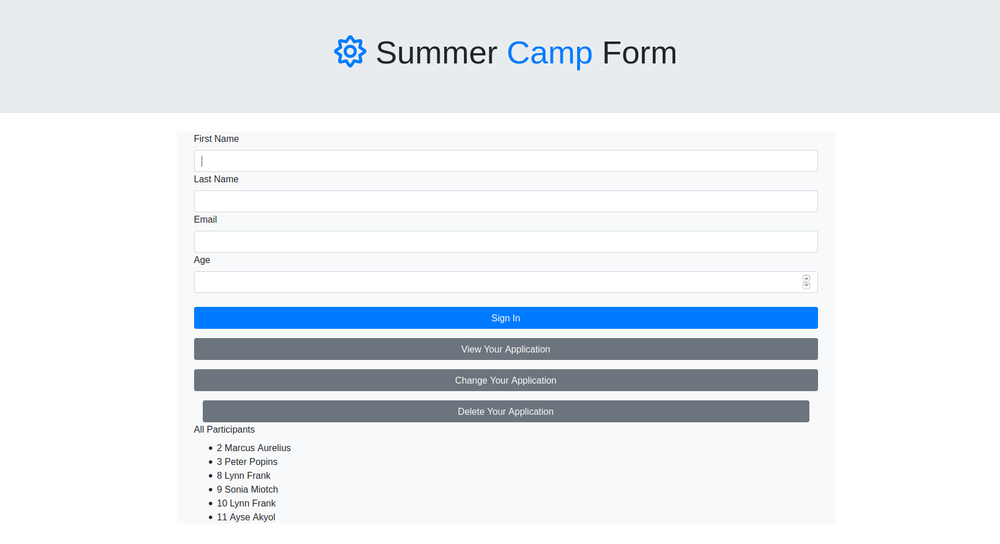

# summer-camp

node full stack

A static web page for rhythmic expression built with HTML, CSS, JavaScript & Node.
Try the live demo [right here](https://summer-camp-form.herokuapp.com/)

It looks something like this:

---

## Notes

Studying this project I learned about:

- Node
- tv4 validation
- making full stack project

This resource was very helpful:

JSON Schema: https://www.youtube.com/watch?v=tp4IzG6oDA0

This app can be used from students who want to participate to the `summer camp`. They will apply with the help of form.

I prepared some starter data by hand and wrote the schema for validation of the data.

I wrote an API that allows users to create, read, update, and delete entries in my data file.
  
At the end I prepared frontend of this app with using `form action and method`. Also I used `bootstrap modal` to prepare update, delete, read one participant forms.
